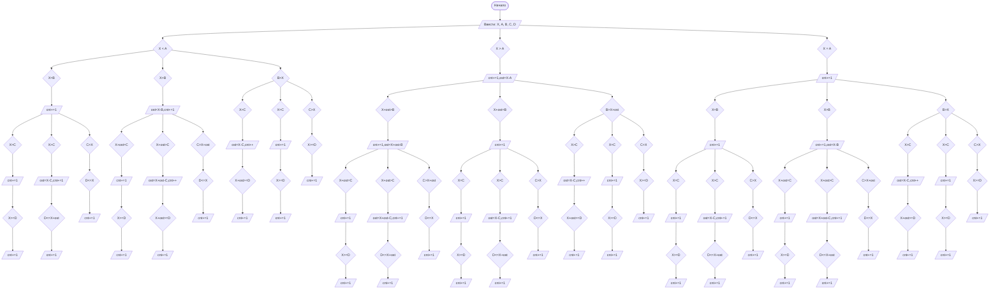

## Отчет по лабораторной работе № 1

#### № группы: `ПМ-2402`

   #### Выполнил: `Ковалев Артемий Алексеевич`

#### Вариант: `12`

### Cодержание:

- [Постановка задачи](#1-постановка-задачи)
- [Входные и выходные данные](#2-входные-и-выходные-данные)
- [Выбор структуры данных](#3-выбор-структуры-данных)
- [Алгоритм](#4-алгоритм)
- [Программа](#5-программа)
- [Анализ правильности решения](#6-анализ-правильности-решения)

### 1. Постановка задачи

> Последовательность из четырех ванночек объемами A, B, C, D литров установлена в указанном порядке ступенькой (объем A — сверху). Ванночки
установлены таким образом, что если в ванночку наливать воду больше её
объема, излишки будут стекать в следующую ванночку, установленную ниже (как каскадный водопад). Изначально все ванночки пусты. В каждую
ванночку выливают воду объемом X литров. Какое количество ванночек
окажется в результате полностью заполненным? На вход программы подаются натуральные числа X, A, B, C, D.

Данную задачу можно разделить на 27 случаев: для начала сравниваем объём воды с объёмом первой ванночки, далее с объёмом второй, третьей и четвертой 
с учётом того, переполнены ли были предыдущие ванночки или их объёмы равнялись объёму воды, или, наоборот, ванночки были полупустыми.

### 2. Входные и выходные данные

#### Данные на вход

На вход программы подаются 5 целых натуральных чисел. Верхняя граница получаемых
чисел не дана.

|                            | Тип         | min значение | max значение |
|----------------------------|-------------|--------------|--------------|
| X (Объём воды в литрах)    | Целое число | 1            | Нет          |
| A (Объём ванны A в литрах) | Целое число | 1            | Нет          |
| B (Объём ванны B в литрах) | Целое число | 1            | Нет          |
| C (Объём ванны C в литрах) | Целое число | 1            | Нет          |
| D (Объём ванны D в литрах) | Целое число | 1            | Нет          |

#### Данные на выход

Т.к. программа должна вывести количество полностью заполненных ванночек, то на выход мы получим
единственное целое неотрицательное число, не превышающее количество ванночек.

|         | Тип                         | min значение | max значение |
|---------|-----------------------------|--------------|--------------|
| Число 1 | Целое неотрицательное число | 0            | 4            |

### 3. Выбор структуры данных

Программа получает 5 целых чисел. Поэтому для их хранения
можно выделить 5 переменных (`X`,`A`,`B`,`C`,`D`) типа `int`. 

|                            | название переменной | Тип (в Java) | 
|----------------------------|---------------------|--------------|
| X (Объём воды в литрах)    | `X`                 | `int`        |
| A (Объём ванны A в литрах) | `A`                 | `int`        |
| B (Объём ванны B в литрах) | `B`                 | `int`        | 
| C (Объём ванны C в литрах) | `C`                 | `int`        | 
| D (Объём ванны D в литрах) | `D`                 | `int`        | 

Также для вывода результата необходимо выделить переменную для хранения числа заполненных ванночек и хранения объёма излишек воды из переполненных ванночек

|           | название переменной   | Тип (в Java) | 
|-----------|-----------------------|--------------|
| Число 1   | `cnt`                 | `int`        |
| Число 2   | `ost`                 | `int`        |


### 4. Алгоритм

#### Алгоритм выполнения программы:

1. **Ввод данных:**
   Программа считывает 5 целых натуральных чисел, обозначенных как `X`,`A`,`B`,`C`,`D`.

   2. **Сравнение чисел:**  
      Программа сравнивает значения `X` и объём ванночки. Если `X` больше, программа прибавляет к переменной `cnt` 1 и вычисляет объём излишек воды, которые затем перейдут в следующую ванночку 
   (от `X` отнимается объём ванночки) и записывает её в переменную `ost`. Затем программа сравнивает уже значение `X+ost` с объёмом следующей ванночки. 
   Если объём следующей ванночки больше, то программа прибавляет к переменной `cnt` 1 и снова вычисляет объём излишек воды и присваивает переменной `ost` новое значение. 
   Если объём следующей ванночки равен значению переменной `X+ost`, то к значению `cnt` прибавляется 1 и так обрабатываются все 4 ванночки. 
   Если же изначально объём исходной ванночки равнялся объёму воды, то к переменной `cnt` прибавляется 1 и по той же схеме сравниваются все остальные ванночки.
   Если объём исходной ванночки меньше объёма воды, сравниваются объём следующей ванночки с объёмом воды.
   
3. **Вывод результата:**  
   На экран выводится количество заполненных ванночек.

#### Блок-схема



### 5. Программа

```java
import java.util.Scanner;

public class Main {
    public static void main(String[] args) {
        Scanner scanner = new Scanner(System.in);

        // Ввод значений
        System.out.print("Введите объем воды X: ");
        int X = scanner.nextInt();

        System.out.print("Введите объем первой ванночки A: ");
        int A = scanner.nextInt();

        System.out.print("Введите объем второй ванночки B: ");
        int B = scanner.nextInt();

        System.out.print("Введите объем третьей ванночки C: ");
        int C = scanner.nextInt();

        System.out.print("Введите объем четвертой ванночки D: ");
        int D = scanner.nextInt();

        
        int cnt = 0; // Подсчет заполненных ванночек
        int ost = 0; // Излишки воды в переполненных ванночках

        if (X<A){
            if(X==B){
                cnt++;
                if(C==X){
                    cnt++;
                    if(D<=X){
                        cnt++;
                    }
                }else if(C<X){
                    ost = X-C;
                    cnt++;
                    if(D<=X+ost){
                        cnt++;
                    }
                }else{
                    if(D<=X){
                        cnt++;
                    }
                }
            }else if(X>B){
                ost = X-B;
                cnt++;
                if(C==X+ost){
                    cnt++;
                    if(D<=X){
                        cnt++;
                    }
                }else if(C<X+ost){
                    ost = X+ost - C;
                    cnt++;
                    if(D<=X+ost){
                        cnt++;
                    }
                }else{
                    if(D<=X){
                        cnt++;
                    }
                }
            }else{
                if(X>C){
                    ost = X-C;
                    cnt++;
                    if (X+ost >= D){
                        cnt++;
                    }
                }
                else if (X == C) {
                    cnt++;
                    if (X >= D)
                        cnt++;
                }else{
                    if (X >= D){
                        cnt++;
                    }
                }
            };
        }else if(X>A){
            cnt++;
            ost = X-A;
            if (B<X+ost){
                cnt++;
                ost = X+ost - B;
                if(C==X+ost){
                    cnt++;
                    if(D<=X){
                        cnt++;
                    }
                }else if(C<X+ost){
                    ost = X+ost - C;
                    cnt++;
                    if(D<=X+ost){
                        cnt++;
                    }
                }else{
                    if(D<=X){
                        cnt++;
                    }}
            }else if(B==X+ost){
                cnt++;
                if(C==X){
                    cnt++;
                    if(D<=X){
                        cnt++;
                    }
                }else if(C<X){
                    ost = X-C;
                    cnt++;
                    if(D<=X+ost){
                        cnt++;
                    }
                }else{
                    if(D<=X){
                        cnt++;
                    }
                }
            }else{
                if(X>C){
                    ost = X-C;
                    cnt++;
                    if (X+ost >= D){
                        cnt++;
                    }
                }
                else if (X == C) {
                    cnt++;
                    if (X >= D)
                        cnt++;
                }else{
                    if (X >= D){
                        cnt++;
                    }
                }
            }
        }else{
            cnt++;
            if(X==B){
                cnt++;
                if(X==C){
                    cnt++;
                    if(X>=D){
                        cnt++;
                    }
                }else if(C<X){
                    ost = X-C;
                    cnt++;
                    if(D<=X+ost){
                        cnt++;
                    }
                }else{
                    if(D<=X){
                        cnt++;
                    }
                }
            }else if(X>B){
                ost = X-B;
                cnt++;
                if(C==X+ost){
                    cnt++;
                    if(D<=X){
                        cnt++;
                    }
                }else if(C<X+ost){
                    ost = X+ost-C;
                    cnt++;
                    if(D<=X+ost){
                        cnt++;
                    }
                }else{
                    if(D<=X){
                        cnt++;
                    }
                }
            }else{
                if(X>C){
                    ost = X-C;
                    cnt++;
                    if (X+ost >= D){
                        cnt++;
                    }
                }
                else if (X == C) {
                    cnt++;
                    if (X >= D)
                        cnt++;
                }else{
                    if (X >= D){
                        cnt++;
                    }

                }
            }
        }
        // Вывод результата
        System.out.println("Количество полностью заполненных ванночек: " + cnt);
    }
}


```

### 6. Анализ правильности решения

Программа работает корректно на всем множестве решений.

1. Тест на `X<A, X=B, X=C, X=>D`:

    - **Input**:
        ```
        3 5 3 3 2
        ```

    - **Output**:
        ```
      3
        ```

2. Тест на `X<A, X=B, X>C, X=>D`:

   - **Input**:
       ```
       3 5 3 2 1
       ```

   - **Output**:
       ```
     3
       ```
3. Тест на `X<A, X>B, X<C, X<=D`:

   - **Input**:
       ```
       4 6 3 5 4
       ```

   - **Output**:
       ```
     3
       ```

4. Тест на `X<A, X>B, X>C, X<=D`:

    - **Input**:
        ```
        4 6 3 2 4
        ```

    - **Output**:
        ```
      3
        ```
5. Тест на `X>A, X>B, X<C, X<=D`:

   - **Input**:
       ```
       6 4 3 7 4
       ```

   - **Output**:
       ```
     4
       ```
6. Тест на `X>A, X=B, X>C, X>=D`:

   - **Input**:
       ```
       6 5 6 4 7
       ```

   - **Output**:
       ```
     4
       ```
7. Тест на `X>A, X<B, X<C, X>=D`:

    - **Input**:
        ```
        6 4 7 8 4
        ```

    - **Output**:
        ```
      3
        ```
8. Тест на `X=A, X>B, X<C, X<D`:

    - **Input**:
        ```
        6 6 5 7 5
        ```

    - **Output**:
        ```
      4
        ```
9. Тест на `X<A, X=B, X<C, X=>D`:

    - **Input**:
        ```
        3 5 3 4 1
        ```

    - **Output**:
        ```
      2
        ```
10. Тест на `X=A, X=B, X>C, X=>D`:

    - **Input**:
        ```
        6 6 6 4 1
        ```

    - **Output**:
        ```
      4
        ```
11. Тест на `X<A, X>B, X<C, X=D`:

    - **Input**:
        ```
        3 5 2 4 3
        ```

    - **Output**:
        ```
      3
        ```
12. Тест на `X=A, X>B, X=C, X<D`:

    - **Input**:
        ```
        3 3 2 3 1
        ```

    - **Output**:
        ```
      4
        ```