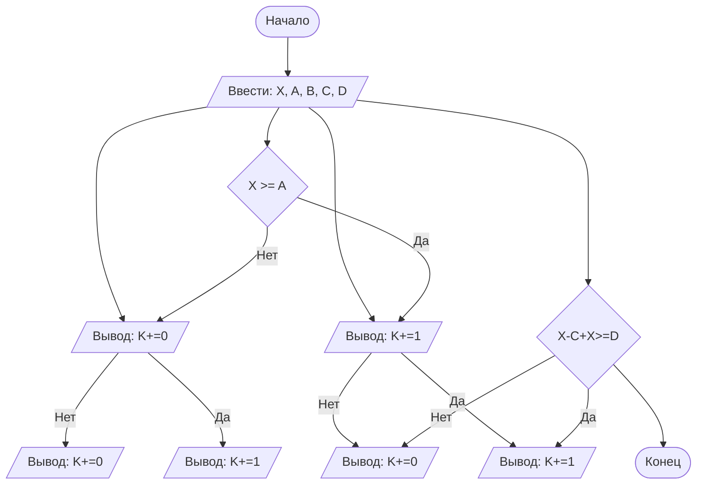

## Отчет по лабораторной работе № 1

#### № группы: `ПМ-2402`

   #### Выполнил: `Ковалев Артемий Алексеевич`

#### Вариант: `12`

### Cодержание:

- [Постановка задачи](#1-постановка-задачи)
- [Входные и выходные данные](#2-входные-и-выходные-данные)
- [Выбор структуры данных](#3-выбор-структуры-данных)
- [Алгоритм](#4-алгоритм)
- [Программа](#5-программа)
- [Анализ правильности решения](#6-анализ-правильности-решения)

### 1. Постановка задачи

> Последовательность из четырех ванночек объемами A, B, C, D литров установлена в указанном порядке ступенькой (объем A — сверху). Ванночки
установлены таким образом, что если в ванночку наливать воду больше её
объема, излишки будут стекать в следующую ванночку, установленную ниже (как каскадный водопад). Изначально все ванночки пусты. В каждую
ванночку выливают воду объемом X литров. Какое количество ванночек
окажется в результате полностью заполненным? На вход программы подаются натуральные числа X, A, B, C, D.

Данную задачу можно разделить на 2 подзадачи: нахождение максимального числа и получение модуля этого числа.

- Для 1 подзадачи нужно рассмотреть 2 случая:
    1. `X >= Y`
    2. `X < Y` (отрицание 1 случая)
- Пусть `Z = max(X, Y)`, тогда для 2 подзадачи нужно также рассмотреть 2 случая:
    1. `Z >= 0`
    2. `Z < 0` (отрицание 1 случая)

Всего надо рассмотреть `2 * 2 = 4` случая.

### 2. Входные и выходные данные

#### Данные на вход

На вход программы подаются 5 целых натуральных чисел. Верхняя граница получаемых
чисел не дана.

|                            | Тип         | min значение | max значение |
|----------------------------|-------------|--------------|--------------|
| X (Объём воды в литрах)    | Целое число | 1            | Нет          |
| A (Объём ванны A в литрах) | Целое число | 1            | Нет          |
| B (Объём ванны B в литрах) | Целое число | 1            | Нет          |
| C (Объём ванны C в литрах) | Целое число | 1            | Нет          |
| D (Объём ванны D в литрах) | Целое число | 1            | Нет          |

#### Данные на выход

Т.к. программа должна вывести количество полностью заполненных ванночек, то на выход мы получим
единственное целое неотрицательное число, не превышающее количество ванночек.

|         | Тип                         | min значение | max значение |
|---------|-----------------------------|--------------|--------------|
| Число 1 | Целое неотрицательное число | 0            | 4            |

### 3. Выбор структуры данных

Программа получает 5 целых чисел. Поэтому для их хранения
можно выделить 5 переменных (`X`,`A`,`B`,`C`,`D`) типа `int`. 

|                            | название переменной | Тип (в Java) | 
|----------------------------|---------------------|--------------|
| X (Объём воды в литрах)    | `X`                 | `int`        |
| A (Объём ванны A в литрах) | `A`                 | `int`        |
| B (Объём ванны B в литрах) | `B`                 | `int`        | 
| C (Объём ванны C в литрах) | `C`                 | `int`        | 
| D (Объём ванны D в литрах) | `D`                 | `int`        | 

Также для вывода результата необходимо выделить переменную для хранения числа заполненных ванночек

|         | название переменной | Тип (в Java) | 
|---------|---------------------|--------------|
| Число 1 | `fullyFilledTanks`  | `int`        |

### 4. Алгоритм

#### Алгоритм выполнения программы:

1. **Ввод данных:**
   Программа считывает 5 целых чисел, обозначенных как `X`,`A`,`B`,`C`,`D`.

2. **Сравнение чисел:**  
   Программа сравнивает значения `X` и `A`. Если `X` больше или равно `A`, программа прибавляет к переменной  `fullyFilledTanks` 1. 
Далее программа сравнивает значения `X-A+X` (к объёму излишек воды из сосуда A прибавляется объём X для ванны B) и значение `B`. Если `B` меньше, 
то программа прибавляет к переменной  `fullyFilledTanks` 1. Затем программа сравнивает значения `X-B+X` (к объёму излишек воды из сосуда B прибавляется объём X для ванны C) и значение `C`. Если `C` меньше,
то программа снова прибавляет к переменной  `fullyFilledTanks` 1. Далее программа сравнивает значения `X-C+X` (к объёму излишек воды из сосуда C прибавляется объём X для ванны D) и значение `D`. Если `D` меньше, 
то программа снова прибавляет к переменной  `fullyFilledTanks` 1.

3. **Вывод результата:**  
   На экран выводится количество заполненных ванночек.

#### Блок-схема



### 5. Программа

```java
import java.util.Scanner;

public class Main {
   public static void main(String[] args) {
      Scanner scanner = new Scanner(System.in);

      // Ввод значений
      System.out.print("Введите объем воды X: ");
      int X = scanner.nextInt();

      System.out.print("Введите объем первой ванночки A: ");
      int A = scanner.nextInt();

      System.out.print("Введите объем второй ванночки B: ");
      int B = scanner.nextInt();

      System.out.print("Введите объем третьей ванночки C: ");
      int C = scanner.nextInt();

      System.out.print("Введите объем четвертой ванночки D: ");
      int D = scanner.nextInt();

      // Подсчет заполненных ванночек
      int fullyFilledTanks = 0;

      if (X>=A){
         fullyFilledTanks+=1;
      }
      if(X-A+X>=B) {
         fullyFilledTanks += 1;
      }
      if(X-B+X>=C){
         fullyFilledTanks+=1;
      }
      if(X-C+X>=D){
         fullyFilledTanks+=1;
      }
      // Вывод результата
      System.out.println("Количество полностью заполненных ванночек: " + fullyFilledTanks);
   }
}
```

### 6. Анализ правильности решения

Программа работает корректно на всем множестве решений с учетом ограничений.

1. Тест на `X > A > B > C > D`:

    - **Input**:
        ```
        5 1.3
        ```

    - **Output**:
        ```
        5
        ```

2. Тест на `X < Y < 0`:

    - **Input**:
        ```
        -4 -2.2
        ```

    - **Output**:
        ```
        2.2
        ```

3. Тест на `X < 0 < Y`:

    - **Input**:
        ```
        -4 5
        ```

    - **Output**:
        ```
        5
        ```

4. Тест на `X = 0` или `Y = 0`:

    - **Input**:
        ```
        0 -3
        ```

    - **Output**:
        ```
        3
        ```

5. Тест на ограничение задачи:

    - **Input**:
        ```
        -1000000000 1000000000
        ```

    - **Output**:
        ```
        1000000000
        ```
